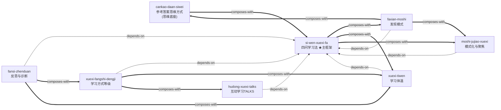

# 《学会如何学习：120堂认知升级课》— Skill Index

> 本书由 cangjie-skill 蒸馏, 共产出 **8** 个 skills（1 主框架 + 7 方向）。
> 处理时间: 2026-07-16

## 关于这本书

- **作者**: 刘澜
- **出版年**: 2025年12月（机械工业出版社）
- **一句话主旨**: 通过对真实学习案例的点评，示范如何用"学习力的五项修炼"（尤其是四问学习法和参考答案思维方式）把碎片经验变成可迁移的模式、把知识真正用起来并改变自己。
- **整书理解**: 见 [BOOK_OVERVIEW.md](./BOOK_OVERVIEW.md)
- **精华长文** (不读全书看这篇): [DIGEST.md](./DIGEST.md)（阶段5生成）
- **术语词典**: [GLOSSARY.md](./GLOSSARY.md)

---

## Skill 列表（按主题分组）

### 主框架 / 枢纽

- [`si-wen-xuexi-fa`](./si-wen-xuexi-fa/SKILL.md) — 四问学习法（听→找→变→用），全书主轴工具，其他 skill 都建立其上

### 学什么

- [`faxian-moshi`](./faxian-moshi/SKILL.md) — 发现模式：分析问题第二步的核心，既是找原因也是找答案，在模式指导下找（主框架第二步深化）
- [`moshi-jujiao-xuexi`](./moshi-jujiao-xuexi/SKILL.md) — 模式化学习与聚焦：学习=模式+碎片、看家模式、聚焦三环（擅长×热爱×机会）、大盗式学习

### 怎么学

- [`xuexi-fangshi-dengji`](./xuexi-fangshi-dengji/SKILL.md) — 学习方式等级模型：被动→主动→建构→{互动,实践}→协作，诊断学习在第几层
- [`hudong-xuexi-talks`](./hudong-xuexi-talks/SKILL.md) — 互动学习 TALKS：讨论五要素、交流四模式、变质疑为请教、给予式分享

### 用什么状态学

- [`xuexi-tiwen`](./xuexi-tiwen/SKILL.md) — 学习要有体温：认知/情感/行为三维度动起来，切己/体会，知识三层境界

### 思维底座

- [`cankao-daan-siwei`](./cankao-daan-siwei/SKILL.md) — 参考答案思维方式：六策略、反过来想、正反合、尚未心态、第四种谦虚/骄傲

### 学不下去时

- [`fansi-zhenduan`](./fansi-zhenduan/SKILL.md) — 反思与诊断：三环学习反思、负面情绪是学习信号、七/八种学习导向诊断、博物馆式/贪官式反面镜

---

## 引用图



图例:
- `-->` depends-on（A 的使用前提是先理解 B）
- `===>` composes-with（A 和 B 经常配合使用）
- `-.->` contrasts-with（本群无对比关系，省略）

**说明**: S1 四问学习法是枢纽，所有方向 skill 都 depends-on 它；S6 参考答案思维方式是思维底座，它 composes-with S1（为四问流程提供"对待答案的态度"）；S2 发现模式是 S1 第二步的专门深化。

---

## 推荐学习顺序

（从依赖图的叶子/底座节点开始，向上）

1. **`cankao-daan-siwei`**（参考答案思维方式）— 思维底座，无前置。先建立"任何答案都是参考答案"的态度。
2. **`si-wen-xuexi-fa`**（四问学习法）— 主框架，是其他所有 skill 的骨架。掌握"听→找→变→用"整体流程。
3. **`faxian-moshi`**（发现模式）— 深化主框架第二步"找"。当你会走四步但卡在"找不到模式"时学这个。
4. **`moshi-jujiao-xuexi`**（模式化与聚焦）— 解决"该学什么、学多少、聚焦哪里"。
5. **`xuexi-fangshi-dengji`**（学习方式等级）— 诊断你的学习在第几层，为何提升不上去。
6. **`xuexi-tiwen`**（学习要有体温）— 检验学习是否真发生（认知/情感/行为三维度）。
7. **`hudong-xuexi-talks`**（互动学习 TALKS）— 互动学习层的操作工具集。
8. **`fansi-zhenduan`**（反思与诊断）— 学不下去时、失败后的补救工具。

> 注：1 和 2 都可作为入口。若你偏好先建思维底座，从 S6 开始；若你想立刻有可用工具，从 S1 开始。

---

## 安装使用

本目录是构建产物，宿主不会从这里加载 skill。要让 agent 真正调用，把 skill 目录复制到宿主的 skills 目录：

```bash
# WorkBuddy 用户级（所有项目可用，首选）
cp -r si-wen-xuexi-fa faxian-moshi moshi-jujiao-xuexi xuexi-fangshi-dengji xuexi-tiwen cankao-daan-siwei hudong-xuexi-talks fansi-zhenduan ~/.workbuddy/skills/

# 或 Claude Code
cp -r si-wen-xuexi-fa ... ~/.claude/skills/

# 或 Cursor
cp -r si-wen-xuexi-fa ... <project>/.cursor/skills/
```

---

## 接入 darwin-skill

所有 skill 均带有 `test-prompts.json`（darwin-skill 兼容格式），可直接接入自动进化。

---

## 审计轨迹

- 候选单元池: [candidates/](./candidates/)（框架57 + 原则88 + 案例65 + 反例30 + 术语31 = 271条）
- 通过三重验证的单元 + 归并设计: [verified.md](./verified.md)
- 被淘汰的候选（含原因）: [rejected/](./rejected/)
- BOOK_OVERVIEW: [BOOK_OVERVIEW.md](./BOOK_OVERVIEW.md)
- 流水线状态: [PIPELINE_STATE.md](./PIPELINE_STATE.md)
